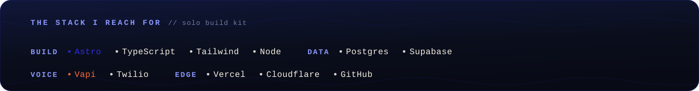

<!-- ════════════════════════════════════════════════════════════════
     david russell · github profile readme  (v2 — field-survey instrument)
     Every banner is hand-drawn animated SVG (assets/). No third-party
     widgets, no badge soup. Light/dark hero auto-swaps via <picture>.
     ════════════════════════════════════════════════════════════════ -->

  <picture>
    <source media="(prefers-color-scheme: dark)" srcset="assets/hero-dark.svg" />
    <source media="(prefers-color-scheme: light)" srcset="assets/hero-light.svg" />
    
  </picture>

 

I build small, evergreen internet businesses — and the systems that run them. Mostly solo, from South Florida, with a small crew of AI agents handling the busywork.

My filter for what I take on: **does it compound? is it asymmetric and evergreen? is it actually profitable?** If the answer's no, I cut it.

 

  

 

## the portfolio

<table>
  <tr>
    <td width="50%"></td>
    <td width="50%"></td>
  </tr>
  <tr>
    <td width="50%"></td>
    <td width="50%"></td>
  </tr>
  <tr>
    <td colspan="2" align="center"></td>
  </tr>
</table>

 

  

 

**Right now** — shipping Cura's founding cohort, and cloning the AI-front-desk model into new verticals where a missed call costs real money.

 

  <a href="https://x.com/heydavidr">X · @heydavidr</a>
  &nbsp;&nbsp;·&nbsp;&nbsp;
  <a href="https://www.linkedin.com/in/heydavidr">LinkedIn</a>
  &nbsp;&nbsp;·&nbsp;&nbsp;
  <a href="https://bsky.app/profile/heydavidr.bsky.social">Bluesky</a>
  &nbsp;&nbsp;·&nbsp;&nbsp;
  <a href="https://davidrussell.co">davidrussell.co</a>

Colophon — every banner here is hand-drawn animated SVG: the field survey, the radar sweep, the tuner, the wordmark that types itself in. Built with the same kit I use for client work. No templates.

